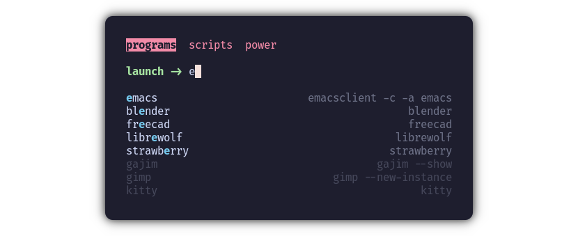

# fr33zmenu

A multi-page fuzzy launcher for your terminal, written in Rust.

Supports theming and multiple keybind schemes, including basic vim keybinds.

[Installation](#installation) - [Usage](#usage) - [Integration](#integration) -
[Configuration](#configuration)

## Installation

If you don't have Rust, follow the installation instructions
[here](https://www.rust-lang.org/tools/install).

Run the following command to install fr33zmenu:

``` sh
cargo install fr33zmenu
```

## Usage

Run the following command to view help: `fr33zmenu --help`

If the command isn't found, you will need to add `~/.cargo/bin` to your path.

``` sh
echo 'export PATH=$PATH:~/.cargo/bin' >> ~/.bashrc
source ~/.bashrc
```

If you're using zsh, replace `~/.bashrc` with `~/.zshrc`.

## Integration

This guide will demonstrate how to integrate fr33zmenu with your window manager.
You'll need to adapt this to your terminal and window manager (obviously), but
for this guide I'm using [Hyprland](https://hyprland.org/) (wayland compositor)
and [Kitty](https://sw.kovidgoyal.net/kitty/) (terminal).

### 1. Create a configuration file

See the [Configuration](#configuration) section below. I saved mine as
`~/.config/fr33menu/menu.toml`.

### 2. Create a script for your window manager to execute

I saved mine as `~/scripts/launcher`.

``` sh
#!/bin/sh

fr33zmenu ~/.config/fr33zmenu/menu.toml \
    --exec-with "nohup hyprctl dispatch exec" \
    --transient
```

### 3. Configure window manager / compositor

Through keybinds and window rules, it's possible to make a terminal window
behave exactly like a graphical launcher. My goal with these settings is to have
the window pop up in the center of the screen at a fixed sized.

The following configuration was added to my `~/.config/hypr/hyprland.conf`.

``` conf
$launcher = kitty --class fr33zmenu ~/scripts/launcher
bind = $mainMod, SPACE, exec, $launcher

windowrulev2 = float, class:fr33zmenu
windowrulev2 = size 600 400, class:fr33zmenu
windowrulev2 = center, class:fr33zmenu
```

If your terminal doesn't support opening with a provided class, you can use the
title of the window instead.

# Configuration

- Supported formats: `toml` `json` `yaml` `ini` `ron` `json5`

Configuration is supported for theming, keybinds, and menus. There is no preset
config directory, as the path to your config file will be passed as a positional
argument. Even so, you may want to store your config(s) in `~/.config/fr33zmenu`
for the sake of organization.

Note: All configuration options must reside in the one file passed to the
program. There is no support for providing or importing multiple config files
(yet?)

## Menus

**Required**

A *menu* defines the interactive content of the program. Each menu is displayed
as a tab on the first line of the interface, and the *entries* of the current
menu are displayed underneath the menu's prompt.

### Example

``` toml
[menus.programs]         # Define a new menu named "programs"
order = -1               # Ensure it is the first menu
prompt = "launch -> "    # Give it a cool prompt

[menus.programs.entries] # Define the menu's entries
# ↓ Name      ↓ Value
emacs      = "emacsclient -c -a emacs"
librewolf  = "librewolf --browser"
strawberry = "strawberry"
gimp       = "gimp --new-instance"
gajim      = "gajim --show"

[menus.power]            # Another menu
prompt = "power -> "

[menus.power.entries]
shutdown = "shutdown now"
reboot = "reboot"
```

## Keybinds

**Optional** - Defaults will be loaded if this section is absent in your config.

- Keybinds must include at exactly *one* non-modifier key.
- One command can have many keybinds, but one keybind cannot be bound to
    multiple commands.
- Keybinds are case-insensitive.

**Named keys**

- Modifier keys
    - `shift`
    - `control` | `ctrl`
    - `alt`
    - `backspace` | `back`
    - `enter` | `return` | `ret`
- Non-modifier keys
    - `left`
    - `right`
    - `up`
    - `down`
    - `home`
    - `end`
    - `pageup` | `pgup`
    - `pagedown` | `pgdn`
    - `tab`
    - `delete` | `del`
    - `insert`
    - `escape` | `esc`


### Example (default keybinds)

``` toml
[keybinds]
exit        = [ "escape", "ctrl+c" ]
submit      = [ "enter" ]
clear       = [ "shift+del", "ctrl+del" ]
delete_next = [ "delete" ]
delete_back = [ "backspace" ]
input_next  = [ "right" ]
input_back  = [ "left" ]
entry_next  = [ "down", "ctrl+down", "ctrl+j", "tab" ]
entry_back  = [ "up", "ctrl+up", "ctrl+k", "shift+tab" ]
menu_next   = [ "ctrl+right", "ctrl+l" ]
menu_back   = [ "ctrl+left", "ctrl+h" ]
```

## Theme

**Optional** - Defaults will be loaded if this section is absent in your config.

All text in the interface can be themed. Every value in the theme accepts the
following properties:

- `fg` - Foreground / text color
- `bg` - Background color
- `attrs` - A comma separated string of text style attributes, e.g. `bold,
      italic, underlined`
    - `bold`
    - `dim`
    - `italic`
    - `underlined`
    - `hidden`

Any valid CSS color string is accepted, but alpha values will have no effect.

### Example (default theme)

``` toml
[theme]
prompt             = { fg = "#a6e3a1", attrs = "bold" }
input              = { fg = "#cdd6f4" }
entry_name         = { fg = "#cdd6f4" }
entry_value        = { fg = "#6c7086" }
entry_match        = { fg = "#74c7ec", attrs = "bold" }
entry_hidden       = { fg = "#45475a" }
entry_cursor       = { fg = "#1e1e2e", bg = "#cdd6f4", attrs = "bold" }
entry_cursor_match = { fg = "#1e1e2e", bg = "#74c7ec", attrs = "bold" }
menu_name          = { fg = "#f38ba8" }
menu_cursor        = { fg = "#1e1e2e", bg = "#f38ba8", attrs = "bold" }
overflow           = { fg = "#f9e2af", attrs = "bold" }
```

